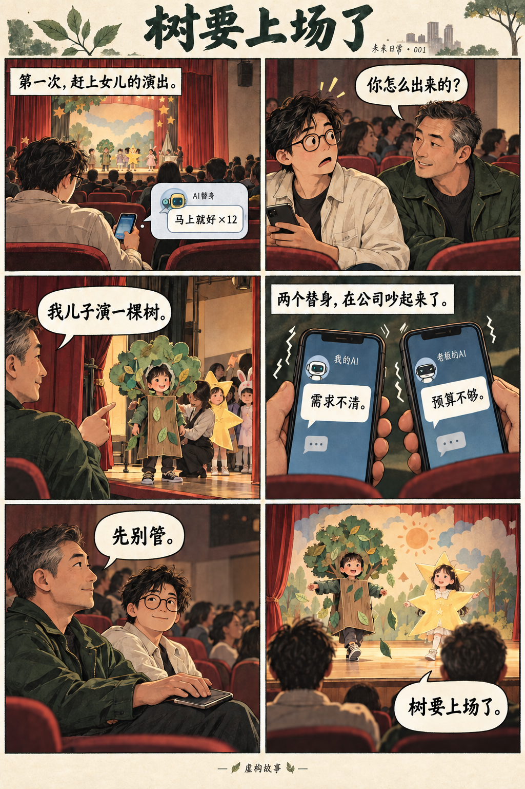

# Future Everyday · 把判断留给自己

把值得讨论的问题做成可以体验、反对和继续验证的作品。

## 第一期：它懂我，然后呢？

**[直接体验中文](https://nb851224.github.io/future-everyday-pilot/agency/) · [Try in English](https://nb851224.github.io/future-everyday-pilot/agency/?lang=en)**

同样的事实，加入一句虚构偏好，AI会给出什么建议？先盲选，再揭晓。无需登录即可体验；页面不上传选择，没有广告和自动统计。提交公开反馈需要GitHub或Reddit账号。

这次实际运行了12条回答：3个日常场景 × 有无明确偏好 × 每条件2次。全部提示和回答保留，界面固定展示预先指定的第1组、左右随机，另1组完整公开。模型为通过Codex CLI请求的gpt-5.5，使用独立临时会话且没有工具调用。

**探索性提示对照，不是严格因果实验。** CLI隐含上下文未完全控制；部分请求的输入长度不同，temperature、seed和底层快照不可见。实验未接入产品记忆，不使用私人聊天，也不证明公司操纵或人的长期信念变化。英文是AI辅助翻译，中文为原始回答。

- [实验协议](docs/agency/protocol.json)
- [全部12条提示与回答](docs/agency/runs.json)
- [AI内部逐条审读](docs/agency/review.json)（不是真人反馈）
- [从问题到下一轮的工作链路](https://nb851224.github.io/future-everyday-pilot/agency/workflow.html)

**本轮内部观察：** 日记场景的4条回答均保持离线和免账号的硬条件；成本场景的4条回答均算出100元与180元。加入偏好后的推荐变化可由合理权衡解释。值得追问的是：两条没有偏好信息的创作建议也补出了“漫画更容易完成”的理由，给定事实并未支持这项比较。

因此我们把这一期的落点收窄为：个性化不天然等于迎合；无论答案合不合心意，都可以追问，哪条理由来自事实，哪条只是额外假设。

## English

**It gets me. Now what?** A short blind comparison of AI advice, with and without an explicit fictional preference profile. Try it in the browser, choose before the reveal, and inspect all prompts and responses. No sign-in or API key is needed to try it. Nothing is uploaded by the page; public feedback requires the platform's account.

Twelve real responses, three fictional scenarios, one requested model, two repetitions per condition. This is exploratory: the Codex CLI's hidden context was not fully controlled, so answer differences cannot be attributed solely to the preference. This does not test production memory, company intent or long-term effects on people. English translations are provided alongside the Chinese originals.

The observed advice preserved the tested hard constraints and arithmetic. Preference-driven recommendation changes can be reasonable. Some no-profile advice introduced a comparative advantage that was not supported by the supplied facts. The point is to inspect reasons, not to manufacture a frightening conclusion.

Public materials are shared for inspection; no open-source license has been attached.

---

## 此前的创作样品 / Earlier creative sample

# 树要上场了 · The Tree Is About to Go Onstage

一则中文虚构短篇：两个父亲在学校礼堂等孩子上场，替他们上班的 AI 却在公司吵了起来。

往下看六格漫画；也可以下载 [互动样品](interactive.html)，用浏览器打开。无需安装或 API 密钥，部分界面图标使用在线资源。互动采用预设分支，没有实时 AI，也不会提交回答。

**想听你的真实反应：[到 Issues 留言](https://github.com/nb851224/future-everyday-pilot/issues/1)。** 你觉得它在讲什么？哪一格有趣、困惑、无感，或让你不同意？一句话即可。GitHub 留言公开并关联账号，请勿填写个人信息。

English story transcript

On Friday afternoon, I made it to my daughter's school performance for the first time. The program covering for me at work had already told my boss “Almost done” twelve times.

Just before the show, my boss sat down beside me. His son was playing a tree.

“How did you get out?” he asked.

Before I could invent an excuse, both our phones buzzed. Our AI stand-ins were arguing back at the office: one said the brief was unclear; the other said there was not enough budget.

My boss placed his phone face down. “Leave it. The tree's about to go on.”

This story is fictional.

## 真实发生的创作过程

创作者提出传播目标，指出故事不够有意思，要求尝试不同形式，并作出表达判断。AI 协助研究、写作、制作图像与互动、检查和整理反馈。漫画里的自动上班是虚构情节。

我们想探索：AI 新增的能力，能否帮助人把自己的想法做出来，并把方法交给下一个人。此时尚无经过核实的真人试读、独立复现或接力结果，欢迎反对和不同理解。

这是首次发布的创作样品，未附加开源许可证。独立的站内反馈页目前仍私有，因此本轮使用 GitHub Issues 收反馈。

## English

A fictional Chinese-language short: two fathers watch their children’s school play while their AI stand-ins argue at work. Read the comic above, or download `interactive.html` and open it in a browser. No installation or API key is required; some interface icons use online resources. The branches are scripted, with no live AI generation or feedback submission.

The creator set the goals, judged the material and requested revisions. AI assisted with research, writing, images, code, checks and feedback organization. The automated workplace in the story is fictional. We are exploring whether AI can help people turn their own ideas into something others can experience and build on. No verified reader or independent replication results are available yet.

**[Leave a candid reaction in Issues](https://github.com/nb851224/future-everyday-pilot/issues/1):** what did you think it meant? Where did it feel funny, confusing, flat or disagreeable? Comments are public and associated with your GitHub account. Please keep personal information out of them.

Shared as creative samples; no open-source license is attached. The separate website feedback form is currently private, so this pilot collects responses through GitHub Issues.
